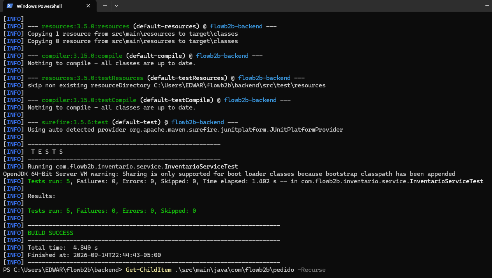
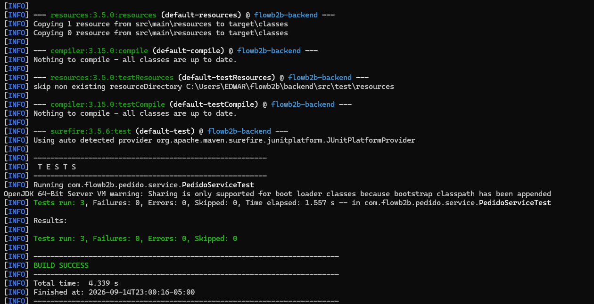
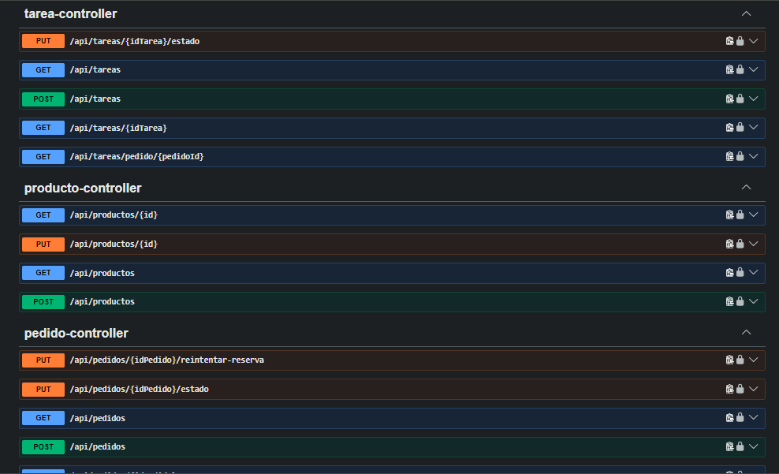
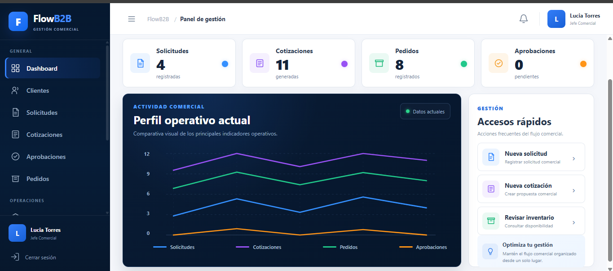
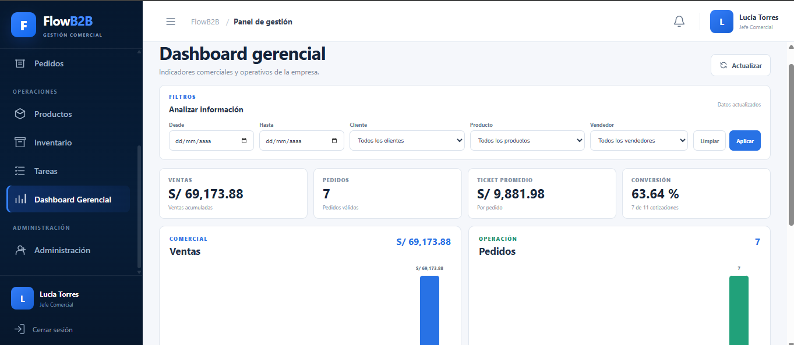
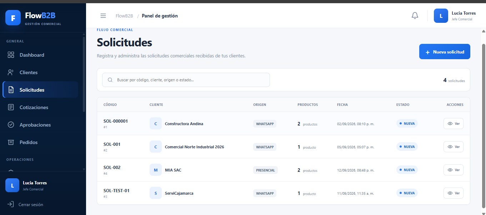
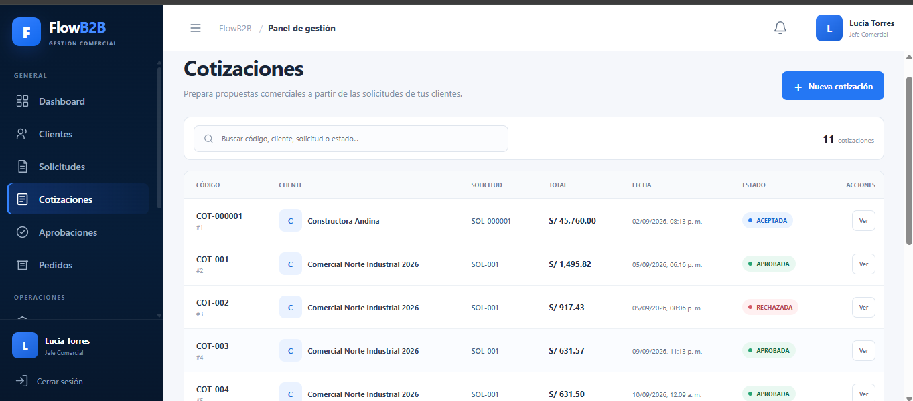
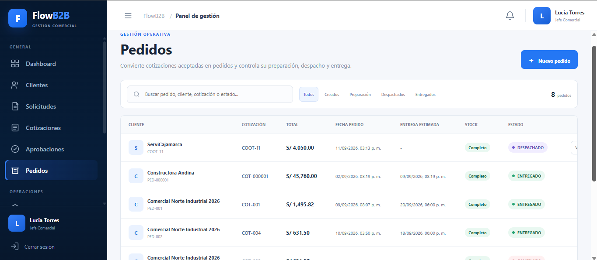
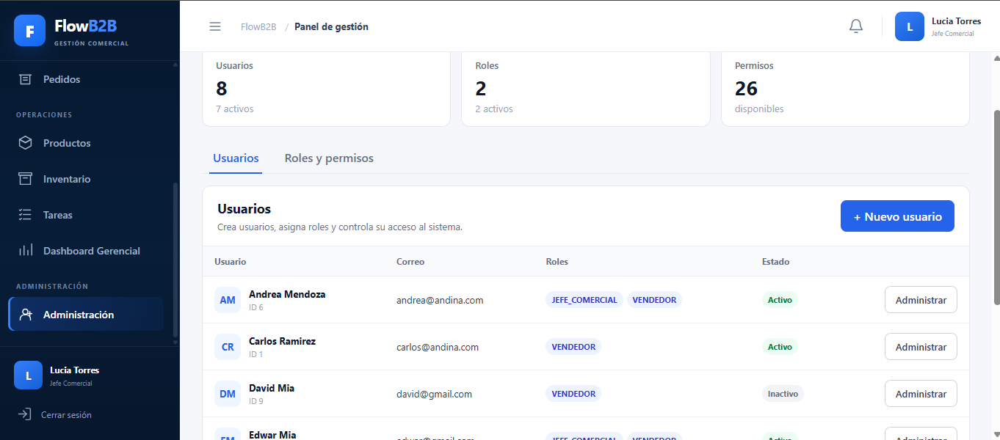

# FlowB2B

**Plataforma web multiempresa para la gestión integral del flujo comercial B2B.**

FlowB2B centraliza el proceso comercial de empresas que gestionan solicitudes, cotizaciones, aprobaciones, pedidos e inventario mediante herramientas separadas como WhatsApp, Excel y correo electrónico.

El sistema permite controlar el flujo desde la solicitud inicial del cliente hasta la preparación y entrega del pedido, manteniendo trazabilidad, seguridad y separación de información por empresa.

## 🌐 Demo visual

https://edwarmia.github.io/flowb2b/

> La demo publicada corresponde a la presentación visual del proyecto. El backend y la base de datos se ejecutan actualmente en entorno local.

---

## 🎯 Problema que resuelve

En muchas empresas B2B, el proceso comercial se encuentra distribuido entre diferentes herramientas:

- Solicitudes recibidas por WhatsApp o correo.
- Cotizaciones elaboradas y controladas manualmente.
- Aprobaciones internas difíciles de rastrear.
- Inventario consultado de manera independiente.
- Pedidos sin seguimiento centralizado.
- Información gerencial dispersa.

**FlowB2B centraliza estas operaciones dentro de una única plataforma.**

---

## 🔄 Flujo principal

```text
Solicitud
    ↓
Cotización
    ↓
Aprobación
    ↓
Aceptación del cliente
    ↓
Pedido
    ↓
Reserva de inventario
    ↓
Preparación
    ↓
Despacho
    ↓
Entrega
```

El sistema mantiene historial de estados y auditoría de las operaciones relevantes realizadas durante el proceso.

---

## ⚙️ Funcionalidades

### Gestión comercial

- Gestión de clientes.
- Gestión de productos y categorías.
- Registro de solicitudes comerciales.
- Creación y seguimiento de cotizaciones.
- Flujo de aprobación interna.
- Aceptación de cotizaciones.
- Generación de pedidos desde cotizaciones aceptadas.

### Pedidos e inventario

- Estados controlados del pedido.
- Reserva automática de inventario.
- Control de stock disponible.
- Manejo de cantidades reservadas y pendientes.
- Reintento de reserva cuando existe nuevo stock.
- Validación de stock antes del despacho.
- Liberación de reservas al cancelar pedidos.
- Actualización del inventario durante el despacho.

### Seguimiento

- Historial de cambios de estado.
- Auditoría de operaciones.
- Gestión de tareas.
- Sistema de notificaciones.

### Analítica

- Dashboard general.
- Dashboard gerencial.
- Indicadores comerciales y operativos.

### Administración

- Gestión de usuarios.
- Gestión de roles.
- Gestión de permisos.
- Activación y desactivación de usuarios.
- Control de acceso basado en permisos.
- Separación de información por empresa.

---

## 🔐 Seguridad

FlowB2B implementa autenticación y autorización mediante:

- Spring Security.
- JSON Web Tokens (JWT).
- Roles y permisos (RBAC).
- Validación del usuario autenticado.
- Aislamiento de información mediante `empresa_id`.
- Validaciones de reglas de negocio en el backend.

La arquitectura multiempresa evita que un usuario pueda consultar información perteneciente a otra empresa.

---

## 🏗️ Arquitectura

```text
┌──────────────────────────────┐
│       Angular Frontend       │
│ Angular 18 + TypeScript      │
└──────────────┬───────────────┘
               │
               │ HTTP / REST
               ▼
┌──────────────────────────────┐
│      Spring Boot Backend     │
│ Java 17 + Spring Security    │
│ JWT + JPA / Hibernate        │
└──────────────┬───────────────┘
               │
               │ JPA
               ▼
┌──────────────────────────────┐
│            MySQL             │
│        flowb2b_db            │
└──────────────────────────────┘
```

El backend está organizado por módulos utilizando controladores, servicios, repositorios, entidades y DTOs.

---

## 🛠️ Tecnologías

**Frontend**

- Angular 18
- TypeScript
- SCSS
- HTML5

**Backend**

- Java 17
- Spring Boot
- Spring Security
- JWT
- Spring Data JPA
- Hibernate
- Maven

**Base de datos**

- MySQL
- InnoDB
- UTF-8 / utf8mb4

**Testing y documentación**

- JUnit 5
- Mockito
- Postman
- Swagger / OpenAPI
- Git
- GitHub

---

## 🧪 Pruebas

Durante el desarrollo se realizaron pruebas manuales de endpoints y reglas de negocio mediante **Postman**.

Además, el proyecto incluye **8 pruebas automatizadas representativas** desarrolladas con **JUnit 5 y Mockito**.

### Inventario

Se validan escenarios como:

- Actualización correcta del inventario.
- Stock reservado superior al stock actual.
- Valores negativos de stock.
- Productos inactivos.
- Aislamiento de información por empresa.

```text
Tests run: 5
Failures: 0
Errors: 0
Skipped: 0
BUILD SUCCESS
```



### Pedidos

Se validan reglas como:

- Transición válida de `CREADO` a `EN_PREPARACION`.
- Rechazo de transiciones de estado no permitidas.
- Bloqueo del despacho cuando existen cantidades pendientes de reservar.

```text
Tests run: 3
Failures: 0
Errors: 0
Skipped: 0
BUILD SUCCESS
```



---

## 📚 API REST

La API se encuentra documentada mediante **Swagger / OpenAPI**.

Durante la ejecución local:

```text
http://localhost:8080/swagger-ui/index.html
```



---

## 📸 Capturas del sistema

### Dashboard



### Dashboard gerencial



### Solicitudes



### Cotizaciones



### Pedidos



### Administración



---

## 📁 Estructura del repositorio

```text
flowb2b/
├── backend/
│   └── Spring Boot REST API
│
├── frontend/
│   └── Angular SPA
│
├── docs/
│   ├── assets/
│   ├── index.html
│   ├── styles.css
│   └── script.js
│
└── README.md
```

---

## 🚀 Ejecución local

### Requisitos

- Java 17
- Node.js
- npm
- MySQL

### Backend

Configurar las variables de entorno:

```text
DB_URL
DB_USERNAME
DB_PASSWORD
JWT_SECRET
```

Desde la carpeta `backend`:

```powershell
.\mvnw.cmd spring-boot:run
```

El backend se ejecuta por defecto en:

```text
http://localhost:8080
```

### Frontend

Desde la carpeta `frontend`:

```powershell
npm install
npm start
```

---

## 📌 Estado del proyecto

**V1 funcional completada.**

La versión actual incluye:

- Flujo comercial B2B.
- Arquitectura multiempresa.
- Autenticación y autorización.
- Roles y permisos.
- Gestión de inventario.
- Pedidos y control de estados.
- Administración de usuarios.
- Trazabilidad y auditoría.
- Notificaciones y tareas.
- Dashboards.
- Documentación de API.
- Pruebas manuales y automatizadas.

FlowB2B no pretende reemplazar un ERP contable completo. Funcionalidades como facturación electrónica, SUNAT, contabilidad, POS y módulos avanzados de compras se encuentran fuera del alcance de esta versión.

---

## 👨‍💻 Autor

**Edwar Mia Aguirre**

Proyecto desarrollado como parte de mi portafolio profesional de **Ingeniería de Sistemas**.

**Repositorio:**  
https://github.com/EDWARMIA/flowb2b

**Demo visual:**  
https://edwarmia.github.io/flowb2b/